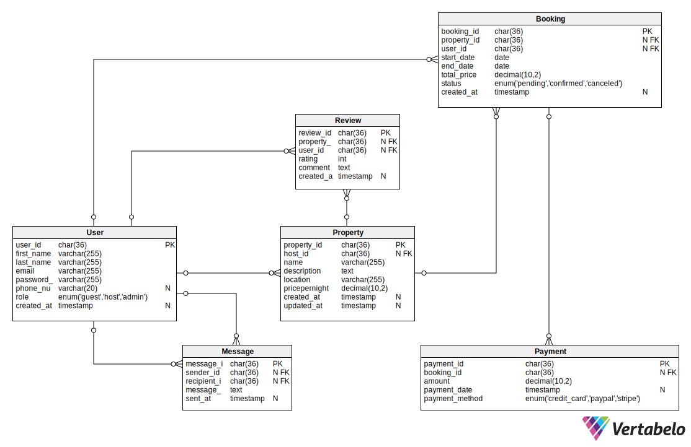

# ERD Requirements

## ✅ Objective
Design and document the Entity-Relationship Diagram (ERD) for the AirBnB database system.

## 📦 Entities and Attributes

### 1. User
- `user_id` (PK, UUID)
- `first_name`, `last_name`
- `email` (UNIQUE)
- `password_hash`
- `phone_number`
- `role` (ENUM: guest, host, admin)
- `created_at`

### 2. Property
- `property_id` (PK, UUID)
- `host_id` (FK → User)
- `name`, `description`, `location`, `pricepernight`
- `created_at`, `updated_at`

### 3. Booking
- `booking_id` (PK, UUID)
- `property_id` (FK → Property)
- `user_id` (FK → User)
- `start_date`, `end_date`
- `total_price`
- `status` (ENUM: pending, confirmed, canceled)
- `created_at`

### 4. Payment
- `payment_id` (PK, UUID)
- `booking_id` (FK → Booking)
- `amount`
- `payment_date`
- `payment_method` (ENUM: credit_card, paypal, stripe)

### 5. Review
- `review_id` (PK, UUID)
- `property_id` (FK → Property)
- `user_id` (FK → User)
- `rating` (1–5)
- `comment`
- `created_at`

### 6. Message
- `message_id` (PK, UUID)
- `sender_id` (FK → User)
- `recipient_id` (FK → User)
- `message_body`
- `sent_at`

---

## 🔗 Relationships

- One `User` can be a **host** for many `Properties`.
- One `User` can make many `Bookings`.
- One `Booking` is linked to one `Property` and one `User`.
- One `Payment` is made for one `Booking`.
- One `Review` belongs to a `User` and a `Property`.
- One `User` can send and receive many `Messages`.

---

## 🛠 Tool Used
This ERD was created using:
- [Vertabelo](https://app.vertabelo.com/)

---

## 📁 File Output

| File                          | Description                        |
|-------------------------------|------------------------------------|
| `ERD/Airbnb_ERDiagram.svg`    | The visual ER diagram              |
| `airbnb_mysql_schema.sql` | Full MySQL-compatible schema    |
| `database-script-0x02/seed.sql`   | Sample data insert statements   |

You can view the ERD image directly below:

---

## ✅ Status
- [x] ERD created
- [x] Schema designed
- [x] Seed data generated